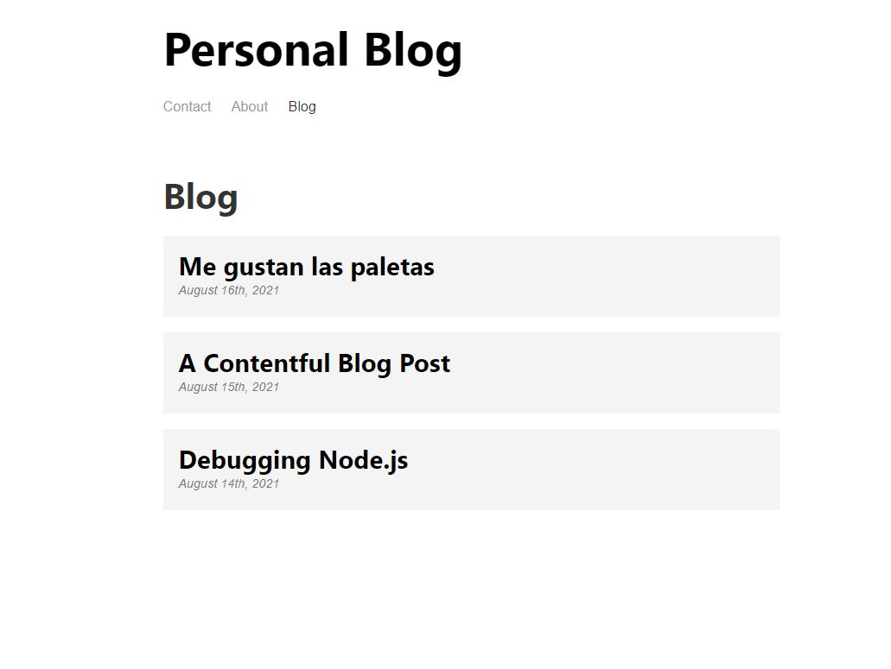

<!-- PROJECT TITE -->
  <h1 align="center">Gatsby Blog</h1>
  
  <!-- DESCRIPTION -->
  

  A working Blog/Introduction page using Gatsby and Contentful as a CMS.

  <!-- DEPLOYED LINK -->
  Video: https://drive.google.com/file/d/1oNlru8k2RrKv6ff3iFCi-IJaRgZxCNj-/view
   
  GitHub repository URL: https://github.com/SaidHadad/GatsbyyBlog

  <!-- TABLE OF CONTENTS -->
  

  
Table of Contents

  <ol>
  <li><a href="#about-the-project">About The Project</a></li>
  <li><a href="#built-with">Built With</a></li>
  <li>
    <a href="#getting-started">Getting Started</a>
    <ul>
    <li><a href="#prerequisites">Prerequisites</a></li>
    <li><a href="#installation">Installation</a></li>
    </ul>
    </li>
  <li><a href="#contributing">Contributing</a></li>
  <li><a href="#license">License</a></li>
  <li><a href="#contact">Contact</a></li>
  </ol>
  

  
  
  <!-- ABOUT THE PROJECT -->
  ## About The Project

    
  A working Blog/Introduction page using Gatsby and Contentful as a CMS.
  
  ## Built With

  * JavaScript
  * node.js
  * Gatsby
  * React
  
  <!-- GETTING STARTED -->
  
  ## Getting Started

  ### Prerequisites

  ### Installation

  npm run develop on the root folder

  <!-- CONTRIBUTING -->
    
  <!-- LICENSE -->
  
  ## License

 

[MIT License](https://choosealicense.com/licenses/mit/)  
  
  <!-- CONTACT -->
  
  ## Contact
  Name: Said David Hadad  
  Email: saiddavid.hadad@gmail.com  
  GIT: https://github.com/SaidHadad  